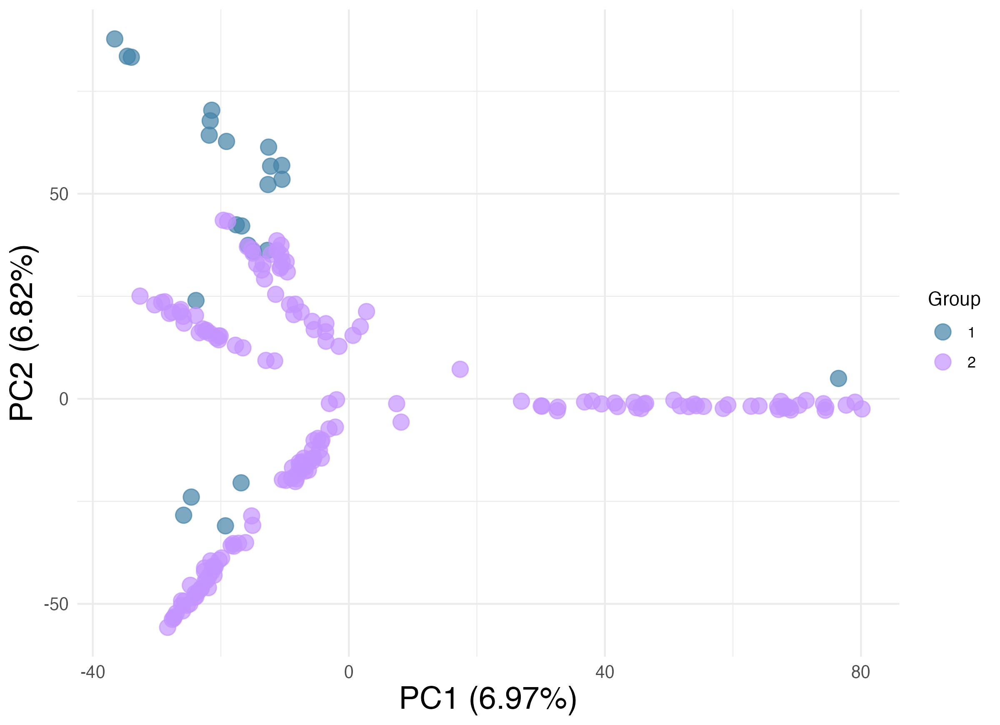
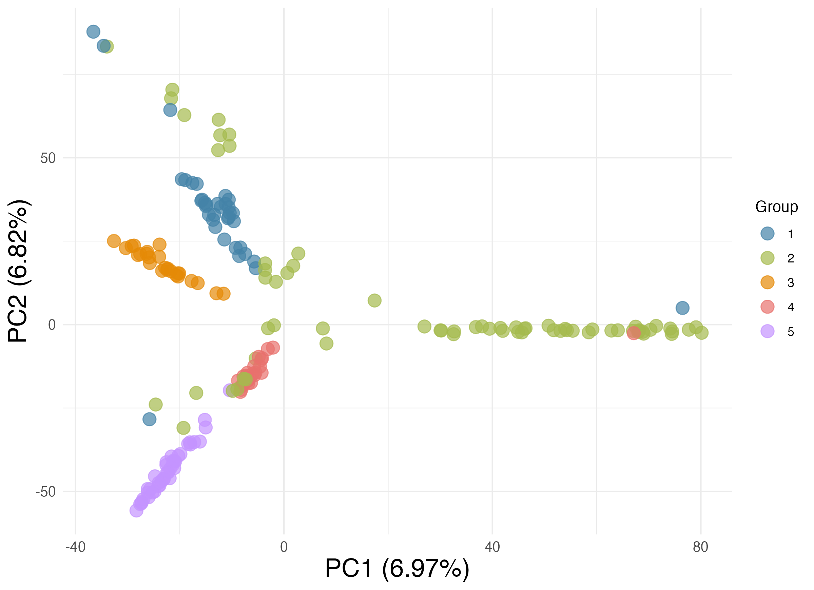

### Contents
[01 Variant calling](https://github.com/tecornell2/bioinformatics/edit/main/VARIANT-CALLING/WGS-nextRAD_SNPs_pipeline.md#01-snp-variant-calling) - 
[02 Pre-filter](https://github.com/tecornell2/bioinformatics/edit/main/VARIANT-CALLING/WGS-nextRAD_SNPs_pipeline.md#02-pre-filter-vcfs) - 
[03 Identify overlap](https://github.com/tecornell2/bioinformatics/edit/main/VARIANT-CALLING/WGS-nextRAD_SNPs_pipeline.md#03-identify-overlapping-snps) - 
[04 Hard filter](https://github.com/tecornell2/bioinformatics/edit/main/VARIANT-CALLING/WGS-nextRAD_SNPs_pipeline.md#04-hard-filter-final-dataset)

### 01 SNP variant calling
```sh
# load package
module load bcftools

### --------------------------------
### Call nextRAD variants
### --------------------------------

REF="/project/viper/venom/Taryn/Plestiodon/Pegregius/nextRAD/genome/Pegre-CLP3001_hifi_hic_genome.clean.fa"
BAMS="/project/viper/venom/Taryn/Plestiodon/Pegregius/nextRAD/02_align/no_rmdup/00_samples_bam_list.txt"

cd /project/viper/venom/Taryn/Plestiodon/Pegregius/nextRAD/03_mpileup/variants

echo "calling RADseq variants..."
bcftools mpileup -Ou -f $REF -b $BAMS --threads 8 -a FORMAT/DP \
  | bcftools call -m -v -f GQ --threads 8 -a GQ,GP -Oz -o joint.vcf.gz

### --------------------------------
### Call WGS variants
### --------------------------------

BAMS="/project/viper/venom/Taryn/Plestiodon/Pegregius/WGS/02_align/00_samples_bam_list.txt"

cd /project/viper/venom/Taryn/Plestiodon/Pegregius/WGS/03_mpileup/variants

echo "calling WGS variants..."
bcftools mpileup -Ou -f $REF -b $BAMS --threads 16 -a FORMAT/DP \
  | bcftools call -m -v -f GQ --threads 16 -a GQ,GP -Oz -o joint.vcf.gz
```

### 02 Pre-filter .vcfs
```sh
# add more tags
bcftools +fill-tags joint.vcf.gz -Ou -- -t F_MISSING | bcftools view -Oz -o joint.tags.vcf.gz

### --------------------------------
### Pre-filter nextRAD
### --------------------------------

bcftools filter
  -S . -i 'FMT/DP >= 5 & FMT/DP <= 35 & FMT/GQ >= 20' joint.tags.vcf.gz |  \ # minDP 5, maxDP 35, GQ 20 per sample (else '.')
  bcftools view -m2 -M2 -v snps \ # biallelic snps only
  -i 'F_MISSING < 0.5' \ # sites with genotypes in at least 50% population
  -Oz -o rad.minDP5.GQ20.FMISS50.biallelic.snps.joint.tags.vcf.gz
# number of SNPs: 701,038

# repeat with WGS
# output: wgs.minDP5.GQ20.FMISS50.biallelic.snps.joint.tags.vcf.gz

# index files
bcftools index -t wgs.50FMISS.maxDP35.minDP5.GQ20.biallelic.snps.joint.tags.vcf.gz
bcftools index -t rad.50FMISS.maxDP35.minDP5.GQ20.biallelic.snps.joint.tags.vcf.gz
```

### 03 Identify overlapping SNPs
```sh
### --------------------------------
### Identify shared sites
### --------------------------------

bcftools isec \
  -n=2 \
  -c none \ # require identical REF and ALT alleles
  -w 1 \ # write .csv of inputs
  wgs*.vcf.gz \
  rad*.vcf.gz \
  -Oz -o wgs-rad.overlap.snps.vcf.gz

bcftools index -t wgs-rad.overlap.snps.vcf.gz

### --------------------------------
### Restrict datasets to identified sites
### --------------------------------

# make tsv
bcftools query \
  -f '%CHROM\t%POS\t%REF\t%ALT\n' \
  wgs-rad.overlap.snps.vcf.gz > overlap.sites.tsv

# pull out sites
bcftools view -R overlap.sites.tsv \
  wgs.50FMISS.maxDP35.minDP5.GQ20.biallelic.snps.joint.tags.vcf.gz -Oz -o wgs.overlap.vcf.gz

bcftools view -R overlap.sites.tsv \
  rad.50FMISS.maxDP35.minDP5.GQ20.biallelic.snps.joint.tags.vcf.gz -Oz -o rad.overlap.vcf.gz

bcftools index -t wgs.overlap.vcf.gz
bcftools index -t rad.overlap.vcf.gz

### --------------------------------
### Merge shared sites
### --------------------------------

# can use merge if there are NO overlapping samples/replicates

bcftools merge \
  wgs.overlap.vcf.gz \
  rad.overlap.vcf.gz \
  -Oz -o wgs-rad.minDP5.maxDP35.GQ20.mpileup.biallelic.snps.vcf.gz

bcftools index -t wgs-rad.minDP5.maxDP35.GQ20.mpileup.biallelic.snps.vcf.gz

# wgs-rad.minDP5.maxDP35.GQ20.mpileup.biallelic.snps.vcf.gz
# number of SNPs:	137,812
# number of samples: 202

```

### 04 Hard filter final dataset

#### Remove outgroup
```sh
bcftools view -s ^CLPT789,CLPT798,CLPT803,CLPT804 --force-samples \
  -Oz -o wgs-rad.no-out.minDP5.maxDP35.GQ20.mpileup.biallelic.snps.vcf.gz \
  wgs-rad.minDP5.maxDP35.GQ20.mpileup.biallelic.snps.vcf.gz
```

#### Calculate missingness per individual
```sh
bcftools stats -s - input.vcf.gz | grep "^PSC" | awk '{print $3, $14}' | sort -k2,2nr
# remove samples if necessary
```

#### Extract file sample list
```sh
bcftools query -l wgs-rad.70imiss.no-out.minDP5.maxDP35.GQ20.mpileup.biallelic.snps.vcf.gz
```

#### MAF and pruning (LD)
```sh
bcftools view -q 0.05:minor input.vcf.gz -O z -o filtered.vcf.gz

bcftools +prune -w 150bp -n 1 -N \
  rand wgs-rad.maf05.70imiss.no-out.minDP5.maxDP35.GQ20.mpileup.biallelic.snps.vcf.gz \
  -Oz -o wgs-rad.thin150.maf05.70imiss.no-out.minDP5.maxDP35.GQ20.mpileup.biallelic.snps.vcf.gz

# number of SNPs: 14,098
```

### Optional: Visualize with ShiNyP: PCA

#### WGS vs nextRAD

1 = WGS (n=23) / 2 = nextRAD (n=174)



#### Subspecies

1 = similis / 2 = onocrepis / 3 = insularis / 4 = lividus / 5 = egregius





#### Visualize with ShiNyP: UPGMA (minimal bootstrapping)

https://github.com/tecornell2/bioinformatics/blob/main/VARIANT-CALLING/14098_50lmiss_phylogenTree.pdf 
